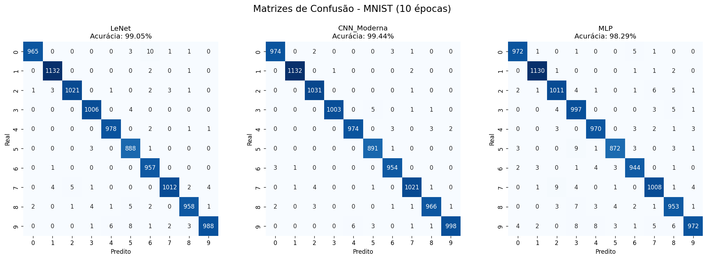
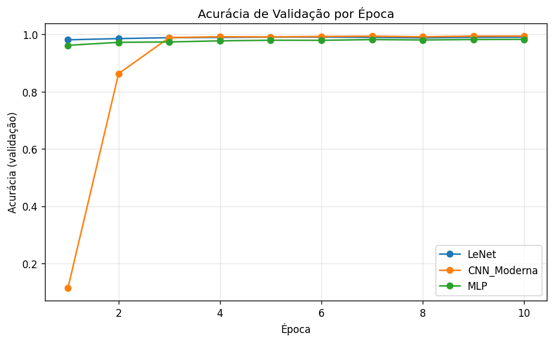

# 🧠 Trabalho 2 — Deep Learning aplicado ao MNIST

<div align="center">


**Reconhecimento de dígitos manuscritos do MNIST com três arquiteturas de redes neurais profundas — LeNet, CNN Moderna e MLP — comparadas pelas suas matrizes de confusão.**

[🚀 Como Usar](#-como-usar) • [📊 Resultados](#-resultados-e-conclusão) • [🧩 Arquiteturas](#-as-três-arquiteturas) • [☁️ Rodar no Colab](COMO_RODAR_NO_COLAB.md)

</div>

---

## 📋 Índice

- [📋 Sobre o Projeto](#-sobre-o-projeto)
- [📁 Estrutura do Projeto](#-estrutura-do-projeto)
- [🧩 As Três Arquiteturas](#-as-três-arquiteturas)
- [🚀 Como Usar](#-como-usar)
- [📊 Resultados e Conclusão](#-resultados-e-conclusão) ⭐ **DESTAQUE**
- [🔗 Link do GitHub](#-link-do-github)
- [📝 Licença](#-licença)
- [👤 Autores](#-autores)

---

## 📋 Sobre o Projeto

Trabalho de **Inteligência Artificial** sobre o **MNIST** (70.000 imagens de dígitos manuscritos 28×28 em tons de cinza). Partindo da implementação da arquitetura **LeNet** do repositório de referência (`marceloarantes19/deepLearning`), pesquisamos e implementamos **mais duas** arquiteturas de redes neurais profundas aplicáveis ao MNIST.

Para cada arquitetura este projeto descreve a **arquitetura** (camadas, ativações), as **características**, treina por **10 épocas** (igual ao exemplo LeNet) e compara as **matrizes de confusão** das três soluções, fechando com uma **conclusão** baseada nos resultados.

> Os números deste README vêm da execução real no **Google Colab com GPU** (10 épocas, `batch_size=256`, otimizador Adam, perda `categorical_crossentropy`).

---

## 📁 Estrutura do Projeto

```
Trabalho-2---Deep-Learning-aplicado-ao-MNist/
│
├── 1_LeNet.ipynb              # Arquitetura 1 — LeNet (notebook)
├── 2_CNN_Moderna.ipynb        # Arquitetura 2 — CNN Moderna (notebook)
├── 3_MLP.ipynb               # Arquitetura 3 — MLP (notebook)
├── 4_Comparacao.ipynb        # Treina as 3 e compara (autossuficiente p/ Colab)
│
├── 📁 solucoes/               # Versão em scripts (.py) das soluções
│   ├── common.py             # Carga de dados, treino e avaliação compartilhados
│   ├── treinar_lenet.py
│   ├── treinar_cnn_moderna.py
│   ├── treinar_mlp.py
│   ├── comparar.py           # Gera os gráficos comparativos
│   └── gerar_notebooks.py    # Gera os 4 notebooks a partir do mesmo código
│
├── 📁 resultados/             # Saídas da execução (gráficos + tabela)
│   ├── matrizes_confusao.png
│   ├── acuracia_por_epoca.png
│   └── resumo.txt
│
├── 📁 deepLearning-main/      # Exemplo LeNet de referência
│
├── COMO_RODAR_NO_COLAB.md     # Guia de execução no Colab (GPU)
├── requirements.txt
├── IA.md                      # Contexto técnico do projeto
└── README.md                  # Este arquivo
```

---

## 🧩 As Três Arquiteturas

### 🧠 1. LeNet (`1_LeNet.ipynb`)

CNN clássica de LeCun (1998), base do exemplo de referência.

**a. Arquitetura (camadas, elementos e ativações):**
| Camada | Configuração | Ativação |
|---|---|---|
| Conv2D | 20 filtros 5×5, padding `same` | ReLU |
| MaxPooling2D | 2×2, stride 2 | — |
| Conv2D | 50 filtros 5×5, padding `same` | ReLU |
| MaxPooling2D | 2×2, stride 2 | — |
| Flatten + Dense | 500 neurônios | ReLU |
| Dense (saída) | 10 neurônios | Softmax |

**b. Características:** dois blocos convolução→pooling extraem características locais (bordas, traços); a camada densa de 500 neurônios combina essas características. É simples, rápida de treinar e já resolve muito bem o MNIST. **Total: 1.256.080 parâmetros.**

---

### 🚀 2. CNN Moderna — estilo VGG com BatchNorm e Dropout (`2_CNN_Moderna.ipynb`)

CNN mais profunda, inspirada na **VGG** (convoluções 3×3 empilhadas), com técnicas modernas de regularização.

**a. Arquitetura (camadas, elementos e ativações):**
| Bloco | Camadas | Ativação |
|---|---|---|
| Bloco 1 | Conv 3×3 (32) → BatchNorm → Conv 3×3 (32) → BatchNorm → MaxPool 2×2 → Dropout 0,25 | ReLU |
| Bloco 2 | Conv 3×3 (64) → BatchNorm → Conv 3×3 (64) → BatchNorm → MaxPool 2×2 → Dropout 0,25 | ReLU |
| Classificador | Flatten → Dense 256 → BatchNorm → Dropout 0,5 → Dense 10 | ReLU / Softmax |

**b. Características:** filtros 3×3 empilhados ampliam o campo receptivo com menos parâmetros; **BatchNormalization** estabiliza e acelera o treino; **Dropout** combate overfitting. É a arquitetura mais robusta e a que mais generaliza. **Total: 872.426 parâmetros** (menos que a LeNet, graças aos filtros 3×3).

---

### 🔢 3. MLP — Perceptron Multicamadas (`3_MLP.ipynb`)

Rede totalmente conectada (sem convoluções), usada como **linha de base**.

**a. Arquitetura (camadas, elementos e ativações):**
| Camada | Configuração | Ativação |
|---|---|---|
| Entrada | vetor de 784 (28×28 achatado) | — |
| Dense | 512 neurônios → Dropout 0,2 | ReLU |
| Dense | 256 neurônios → Dropout 0,2 | ReLU |
| Dense (saída) | 10 neurônios | Softmax |

**b. Características:** **ignora a estrutura espacial** da imagem (trata os pixels como vetor independente). Treina muito rápido e tem menos parâmetros, mas não captura padrões locais como as CNNs — por isso erra mais. **Total: 535.818 parâmetros.**

---

## 🚀 Como Usar

### Opção 1: Google Colab com GPU (Recomendado!) ☁️

A forma mais rápida — treina as três redes em poucos minutos. Veja o [guia completo](COMO_RODAR_NO_COLAB.md).

[](https://colab.research.google.com/github/Felipe-Alcantara/Trabalho-2---Deep-Learning-aplicado-ao-MNist/blob/main/4_Comparacao.ipynb)

1. Abra o `4_Comparacao.ipynb` (badge acima).
2. **Ambiente de execução → Alterar o tipo → GPU**.
3. **Ambiente de execução → Executar tudo**.

### Opção 2: Local (CPU)

```bash
# Clone o repositório
git clone https://github.com/Felipe-Alcantara/Trabalho-2---Deep-Learning-aplicado-ao-MNist.git
cd Trabalho-2---Deep-Learning-aplicado-ao-MNist

# Ambiente virtual + dependências
python -m venv .venv
source .venv/bin/activate        # Windows: .venv\Scripts\activate
pip install -r requirements.txt

# Treina as três redes e gera os gráficos comparativos
cd solucoes
python treinar_lenet.py
python treinar_cnn_moderna.py
python treinar_mlp.py
python comparar.py
```

---

## 📊 Resultados e Conclusão

Execução real no **Google Colab (GPU)** — 10 épocas cada.

### Tabela-resumo (item d)

| Arquitetura | Parâmetros | Acurácia no teste | Erros (em 10.000) |
|---|---|---|---|
| 🚀 **CNN Moderna** | 872.426 | **99,44%** 🥇 | **56** |
| 🧠 LeNet | 1.256.080 | 99,05% 🥈 | 95 |
| 🔢 MLP | 535.818 | 98,29% 🥉 | 171 |

### Matrizes de Confusão das três soluções



### Acurácia de validação por época



### Análise das matrizes de confusão (item d)

- **CNN Moderna** — a matriz mais "limpa": só **56 erros**, bem distribuídos, sem nenhuma confusão sistemática grande. A diagonal é fortíssima em todas as classes.
- **LeNet** — **95 erros**, também excelente. Os enganos se concentram em dígitos visualmente parecidos (ex.: alguns `0`→`6` e dispersão no `9`), típicos do MNIST.
- **MLP** — **171 erros**, quase o triplo da CNN Moderna. Os erros aparecem **mais espalhados** pela matriz (ex.: `7`↔`2`, `5`↔`3`, `9`↔`3/4/7`), justamente porque a rede densa não enxerga a forma do traço, só intensidades de pixel.

### Conclusão (item e)

1. **As redes convolucionais vencem o MLP** com folga. Mesmo o MLP atingindo 98,29% (o MNIST é um problema "fácil"), ele comete quase 3× mais erros que a CNN Moderna — evidência de que **explorar a estrutura espacial da imagem (convoluções) importa** em problemas de visão.
2. **A CNN Moderna foi a melhor** (99,44%) e ainda usando **menos parâmetros que a LeNet**. O ganho vem da profundidade (convoluções 3×3 empilhadas) somada a **BatchNormalization** (treino estável) e **Dropout** (menos overfitting).
3. **Detalhe da curva de aprendizado:** a CNN Moderna começa ruim na época 1 (~11%, efeito do BatchNorm antes de estabilizar as estatísticas) e **dispara a partir da época 2-3**, ultrapassando as demais. LeNet já nasce alta e estável; o MLP fica consistentemente abaixo das duas CNNs.
4. **Resumindo:** para o MNIST em 10 épocas, **CNN Moderna > LeNet > MLP**. A arquitetura mais moderna entrega a melhor acurácia com o menor número de erros e de parâmetros — o melhor custo-benefício.

---

## 🔗 Link do GitHub

Repositório da equipe com todas as soluções (item f):

👉 **https://github.com/Felipe-Alcantara/Trabalho-2---Deep-Learning-aplicado-ao-MNist**

---

## 📝 Licença

Este projeto está sob a licença MIT — veja o arquivo [`LICENSE`](LICENSE).

---

## 👤 Autores

Felipe Alcantara Martins
Iasmin Oliveira Laje

- GitHub: [@Felipe-Alcantara](https://github.com/Felipe-Alcantara)
- Arquitetura base (LeNet): [marceloarantes19/deepLearning](https://github.com/marceloarantes19/deepLearning)

---